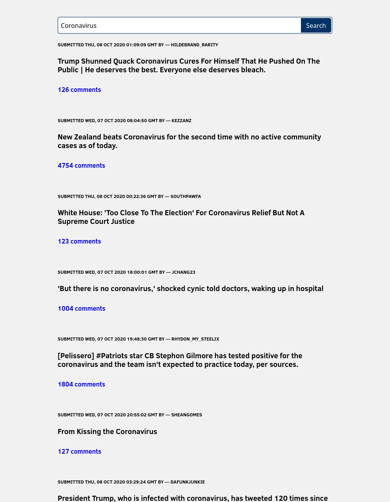

<p align="center">
  <a href="https://github.com/lsprr/reddit-search">
    
  </a>
    <a href="https://github.com/lsprr/reddit-search">
    
  </a>
  <h1 align="center">Reddit Search</h1>
</p>

## Table of Contents

* [About The Project](#about-the-project)
  * [Built With](#built-with)
* [Demo](#demo)
* [Getting Started](#getting-started)
  * [Installation](#installation)
* [License](#license)

## About The Project
🔎 A simple reddit search web app using vanilla JavaScript


### Built With
* [Parcel](https://parceljs.org/)
* JavaScript ES6
* Fetch API
* CSS

### Demo


## Getting Started

### Installation

1. Clone the repo

2. Install NPM packages
```sh
npm install
```
3. Runs the app in the development mode.
```sh
npm start
```
4. Open [http://localhost:1234](http://localhost:1234) to view it in the browser.

## License
This project is open source and available under the [MIT License](LICENSE).
